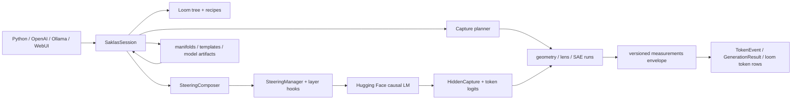

# Saklas architecture

This document explains the current system as a whole: how artifacts are fitted,
how a steering expression reaches a model forward, how hidden states become
measurements, and how the library, server, and WebUI share those mechanisms.

The subtree `AGENTS.md` files are detailed ownership maps. This file stays at the
cross-cutting level and calls out the invariants that must survive changes across
modules.

## 1. System in one page

Saklas is one model-owning session with three front doors:

- `SaklasSession`, the Python API;
- `saklas serve`, which exposes OpenAI, Ollama, and native Saklas protocols;
- the Svelte WebUI mounted by that server.

All three converge on the same generation, steering, capture, and measurement
paths.



The architecture has two intentionally different planes:

- The **steering plane** resolves an expression, composes all compatible terms,
  and injects one update per affected layer.
- The **read plane** plans hidden-state retention, binds immutable
  per-generation instrument state, and produces geometry, J-lens, and SAE
  readings without changing the steering representation.

They meet at gates: a steering trigger may depend on a read-side scalar, so the
capture plan must retain and score exactly the channels needed before the next
steered forward.

## 2. Ownership boundaries

| Concern | Owner | Notes |
|---|---|---|
| Model/tokenizer loading and layer access | `core/model.py` | Normalizes supported Hugging Face architectures to one transformer-block interface. |
| Session orchestration | `core/session.py` | Owns the model, loom, registries, locks, capture transaction, and public API. |
| Token generation | `core/generation.py` | Sampling, cache advancement, thinking channels, stop handling, and token-step identity. |
| Steering syntax | `core/steering_expr.py`, `core/steering.py` | Parses and round-trips the one expression language used everywhere. |
| Steering resolution/composition | `core/steering_composer.py` | Resolves selectors, materializes projections, validates gates, and installs composed steering. |
| Injection | `core/hooks.py`, `core/manifold.py` | Lowers composed terms to per-layer hooks and executes the flat or curved kernel. |
| Hidden capture | `core/hooks.py::HiddenCapture` | Retains the minimum layer/time slices selected by the session planner. |
| Read protocol | `core/instruments/` | Three instrument families under one prepare/plan/bind/observe contract. |
| Geometry reads | `core/monitor.py` | Mahalanobis coordinates, distances, assignments, membership, and per-layer traces. |
| J-lens | `core/jlens.py` | Fit, transport, readout, token directions, and J-space decomposition. |
| SAE runtime/training | `core/sae.py`, `core/sae_training.py` | External or local sources, feature readout, and decoder-row steering. |
| Result shapes | `core/results.py`, `core/measurements.py`, `core/token_payloads.py` | Python results and the canonical read-side wire envelope. |
| Conversation state | `core/loom.py` | Branching authored/generated nodes, recipes, raw tokens, measurements, cast, and persistence. |
| Artifact I/O | `io/` | Exact schemas, selectors, integrity, atomic publication, Hugging Face distribution, and lifecycle. |
| HTTP/WebSocket protocols | `server/` | Thin validation/serialization layers over one session. |
| Dashboard | `webui/`, `saklas/web/` | Svelte source plus the committed production bundle served last as an SPA. |

The main dependency direction is `server/cli/web -> session -> core + io`. Pure
geometry in `core/manifold.py` does not import the session or persistence layer;
tensor codecs and filesystem transactions stay in `io/`.

## 3. Runtime objects and durable artifacts

### 3.1 The manifold is the steering artifact family

A manifold is a set of labeled nodes, a domain or discovered layout, and a
per-model fit at selected residual-stream layers.

There are two runtime geometries:

- A **flat subspace** stores a neutral-anchored affine frame: `mean`, an
  orthonormal `basis`, and real per-layer node coordinates. A rank-1, two-node
  flat fit is the ordinary bipolar steering-vector case. A one-node flat fit is
  a monopolar ray from the neutral mean.
- A **curved manifold** stores the same enclosing frame plus an RBF surface,
  its Jacobian, a neutral-origin foot, and optionally a learned local tube
  thickness.

`LayerSubspace` is one layer's fitted frame. `Manifold` groups those layers with
the shared authoring metadata. `SynthesizedSubspace` is not durable: it is the
per-dispatch affine result of composing the active expression.

`Profile` remains the in-memory `dict[layer, direction]` view used by vector-like
APIs, comparison, projection, J-lens/SAE directions, and GGUF export. Extracted
concepts are not stored in a second profile tree; a fitted two-node manifold is
folded to a `Profile` when a vector-shaped consumer needs it.

### 3.2 Fit modes

The folder manifest selects one of five modes:

- `authored`: node coordinates and a domain are supplied; the fit builds a
  curved surface.
- `pca`: coordinates are discovered from node corpora and the result is flat.
- `spectral`: coordinates are discovered from neighborhood geometry and the
  result is curved.
- `auto`: topology selection chooses a flat, curved, or periodic result from
  the fitted evidence.
- `baked`: the folder contains a precomputed, corpus-less direction rather than
  material that can be refitted.

The two-node extraction path is discover-`pca` with rank capped at one. There is
no separate vector extraction method or `pca` selector variant.

### 3.3 Templates

A template is a slot token, candidate values, and one or more multi-turn
contexts. It has two consumers:

- `score_choices`/`score_template` evaluate the restricted-choice probability
  distribution;
- `manifold from-template` materializes one node corpus per candidate and keeps
  a `template_ref`, so later context/value edits invalidate the fit identity.

The slot appears exactly once in the final assistant continuation and never in
the shared history. Templates live independently of manifolds because scoring
does not require a manifold fit.

### 3.4 Per-model read sources

The Jacobian lens and SAE are model-scoped sources, not concept manifolds.

- A J-lens contains one fp32 transport matrix `J_l` per fitted source layer.
  Saklas-owned fits use immutable shards behind a manifest; external
  Neuronpedia payloads remain in the Hugging Face cache behind a pinned local
  binding.
- A Saklas-trained SAE stores local encoder/decoder weights. A SAELens source
  remains provider-owned; Saklas stores only its selected release/layer binding
  and optional feature metadata.

Both source families have an `active.json` selector. A source switch is visible
to the next generation, never halfway through a bound instrument run.

### 3.5 Loom and result objects

`LoomTree` is the session's authoritative conversation graph. A `LoomNode`
records authorship/provenance, role, recipe, raw token IDs, token measurements,
aggregate readings, finish metadata, notes, stars, and child relationships.
Generatedness comes from a stamped `Recipe`, not from the node's `user` or
`assistant` role.

Library generation returns a list-like `RunSet` of `GenerationResult` objects.
Streaming yields `TokenEvent` objects and exposes the final result when the
stream closes. The loom and the result types share data but are not aliases:
stateless calls produce results without mutating the tree.

## 4. Local state and artifact identity

All Saklas-owned state resolves through `io.paths.saklas_home()` and honors
`$SAKLAS_HOME`.

```text
~/.saklas/
  config.yaml                              optional default CLI/server config
  baseline_prompts.json                    optional override for bundled prompts
  neutral_statements.json                  optional override for bundled neutral responses
  templates/<namespace>/<name>/
    template.json
  manifolds/<namespace>/<name>/
    manifold.json
    nodes/NN_<label>.json
    <encoded-model>.safetensors
    <encoded-model>.json
    <encoded-model>_sae-<release>.{safetensors,json}
    <encoded-model>_from-<source>.{safetensors,json}
  models/<encoded-model>/
    neutral_activations.{safetensors,json}
    alignments/<encoded-source>.{safetensors,json}
    jlens/
      active.json
      bindings/<provider>.json
      local/default/
        manifest.json
        checkpoint.json                    only while a resumable fit exists
        jlens*.gen-*.safetensors
    sae/
      active.json
      bindings/<release>.json
      bindings/<release>-features.json
      local/<name>/
        manifest.json
        *.safetensors
```

Conversation exports are browser-downloaded JSON files or explicit
`LoomTree.save()` targets; Saklas does not invent a conversation directory or
autosave a session under `$SAKLAS_HOME`.

Identity is stricter than a friendly model name. Fitted sidecars carry the
loaded-model/source fingerprint, selected layers, artifact hashes, and the
inputs that make reuse safe. Provider bindings pin revisions. Manifest-declared
files and fitted payloads are SHA-256 verified before adoption.

Writers use stable artifact locks, temporary files, fsync, and atomic pointer or
manifest replacement. Long fits publish immutable generations and leave the
previous complete generation authoritative until the new pointer is durable.
Readers do not treat an incomplete or mismatched artifact as a partial success.

## 5. Extraction and fitting

### 5.1 Authoring the corpora

`session.extract`, `manifold generate`, and their HTTP/CLI wrappers author node
corpora from a shared prompt set. The model answers those prompts in character;
the response list is aligned to the prompt list by index. A role-augmented fit
substitutes the assistant label during elicitation and records the role so the
same baseline can be selected at steering time.

`extract_from_corpora` skips generation and starts with caller-supplied nodes.
`from-template` deterministically expands values across template contexts.

Bundled neutral responses—or an explicit user/model-generated override—use the
same baseline prompts without a concept persona. They become the per-model
reference distribution for centering and whitening.

### 5.2 Capturing node statistics

`core/capture.py` and the fit helpers in `core/manifold.py` capture selected
residual-stream layers in right-padded batches. For each row, pooling uses the
last non-special content token; chat-template trailers and added special tokens
are walked back before pooling.

The fitting path batches across node boundaries, adapts after OOM, and retains
centroids rather than full token stacks whenever possible. Curved fits that need
within-node covariance spool activation rows in bounded, layer-major storage
instead of keeping the full corpus on the accelerator.

Capture may stop after the highest requested transformer block. Cache identity
includes prompt/corpus content, tokenizer render identity, model fingerprint,
and layer coverage, so a scoped top-up can reuse proven layers without claiming
coverage it never captured.

### 5.3 Neutral anchoring and the Mahalanobis metric

Neutral activations are stored in fp32. This is a range invariant: late-layer
residual channels can overflow fp16 and would poison covariance-derived reads.

For layer `L`, the whitener keeps centered neutral rows `X_L` and a Woodbury
representation of the regularized inverse covariance. It can apply
`Sigma_L^-1`, compute Mahalanobis norms/cosines, form reduced-space Gram
matrices, and construct the LEACE projection without materializing a dense
hidden-size-square covariance.

Activation-space fitting, monitoring, projection, comparison, transfer
rebaking, and share calibration require complete finite whitener coverage for
their selected layers. There is no silent Euclidean fallback on those surfaces.

Every fitted frame is neutral-anchored:

- the stored affine mean is the projection of the neutral mean into the fitted
  span;
- real node coordinates are measured relative to that anchor;
- zero in the flat frame therefore means neutral behavior.

The basis itself is derived from the node-centroid scatter around the nodes'
own mean, not around neutral. For two nodes this preserves the difference-of-
means axis; the whitened form is the Fisher/LDA direction.

### 5.4 Discovering and fitting geometry

For discover modes, each layer contributes a whitened node Gram matrix. Their
mean is a layer-agnostic consensus geometry in common background-variance
units.

- PCA coordinates come from its eigendecomposition.
- Spectral coordinates come from pairwise distances, a symmetric k-nearest
  neighbor graph, and the normalized graph Laplacian.
- Auto mode compares candidate geometry/topology evidence and can recognize a
  periodic axis.

Flat fits use an orthonormal basis and real per-layer node coordinates. Curved
fits add an RBF interpolation through node centroids. Raw curved fits can also
fit a log-thickness field from the activation rows; runtime membership and soft
`onto` semantics consume that field.

The fit publishes two kinds of calibration:

- per-layer Mahalanobis share, used to distribute the steering/read budget;
- diagnostics such as full between-node spread and topology/fit evidence,
  surfaced for inspection but not used as hidden runtime switches.

Discriminative layer selection applies to flat axes. It keeps an axis where
node projections straddle the neutral baseline; `--no-dls` keeps the unpruned
flat fit. Curved fits do not invent a polarity and therefore do not apply DLS.

## 6. Steering language and lowering

### 6.1 One grammar

Every live steering surface parses through `core/steering_expr.py` and can
round-trip with `format_expr`.

```text
expr        := term (("+" | "-") term)*
term        := [coefficient ["*"]] ["!"] selector ["@" trigger]
selector    := atom (("~" | "|") atom | "%" position)?
position    := signed_number ("," signed_number)* | label
trigger     := phase | "when:" probe comparison number
```

The important operators are:

| Form | Meaning |
|---|---|
| `0.3 warm` | Push along a vector-like direction. |
| `a~b` | Keep the Mahalanobis component of `a` shared with `b`. |
| `a\|b` | Remove the Mahalanobis component of `a` shared with `b`. |
| `!a` | Mean-ablate `a`; a coefficient gives partial or signed collapse. |
| `M%label` | Move toward a named manifold node. |
| `M%x,y` | Move toward authoring coordinates on a manifold. |
| `@prompt`, `@response`, ... | Restrict the token phase. |
| `@when:key>value` | Activate from a live instrument scalar. |

A manifold coefficient may be `along` or `along,onto`. `along` moves within
the fitted geometry; `onto` reduces off-surface residual inside a curved
manifold's enclosing span.

Selectors support namespaces and fitted variants. Bare names first resolve
two-node poles/manifold names, then multi-node labels. Cross-tier or
cross-namespace collisions raise instead of choosing silently. `jlens` and
`sae` are reserved namespaces for their runtime atoms.

### 6.2 Resolution and composition

`SteeringComposer` turns the parsed values into concrete runtime terms:

1. Resolve fitted manifolds, registered profiles, J-lens token directions, and
   SAE decoder rows lazily.
2. Materialize `~`/`|` projection terms with the model-matched whitener.
3. Validate every gate key against the channels its instrument family can
   produce.
4. Resolve role implications and choose one active render baseline.
5. Group terms by trigger and synthesize compatible affine terms.
6. Register curved terms separately, then ask `SteeringManager` to lower the
   result into layer hooks.

Vector-like terms are folded into neutral-anchored rank-1 frames. Flat manifold
positions contribute their fitted basis and per-layer target. Ablations add
collapse axes. All affine terms under one trigger become one
`SynthesizedSubspace` per layer; the synthesis preserves partial, repeated,
negative, and non-orthogonal ablations.

Two curved manifolds may share a layer only when their spans are effectively
orthogonal. The merged affine span is orthogonalized against curved spans, with
the curved geometry owning the overlap. This prevents one term from overwriting
another's in-subspace component.

### 6.3 Injection

`core/manifold.py::subspace_inject` is the only injection kernel.

For a flat subspace, an activation is decomposed into reduced coordinates `q`
and an off-subspace residual. The hot path updates only `q`:

```text
q_new = q + effective_along * (target - collapse * q)
h_new = neutral_mean + q_new @ basis + off_subspace_residual
```

Push axes translate every token by the same offset and preserve its existing
in-subspace variation. Ablation axes collapse toward neutral by the requested
amount. The off-subspace residual is unchanged.

For a curved manifold, the kernel finds or warm-starts the activation's nearest
surface foot, translates that foot through the domain, transports the local
off-manifold residual between tangent frames, and optionally shrinks it toward
the fitted tube. The off-*subspace* residual is still unchanged.

Per-layer shares are normalized at application time. Global operation gains
live beside the hook implementation; they are not artifact-specific knobs.
Always-active affine steering has a precomposed constant/low-rank fast path.
Curved, phase-triggered, and gated terms use the general context-aware path.

### 6.4 Triggers and gates

`TriggerContext` is updated before each forward with prefill/decode phase,
thinking state, raw generation step, and the most recent gate scalars. Hooks
consult it only when their term is dynamic; the common static-affine path does
not pay for that branch.

Gate keys are parsed into typed channels:

- coordinate axis: `probe` or `probe[axis]`;
- subspace fraction: `probe:fraction`;
- curved-tube membership: `probe:membership`;
- normalized label distance: `probe@label`;
- soft label assignment: `probe~label`.

Geometry supports all applicable channels. J-lens and SAE probes expose one
real strength axis only. An impossible key, such as SAE membership, fails during
composition rather than becoming a permanently false trigger.

## 7. The read plane

### 7.1 Three instrument families

The registry `session.instruments` contains:

| Family | Persistent owner | Native unit |
|---|---|---|
| `geometry` | `GeometryInstrument` over `Monitor` | Domain coordinate, Mahalanobis fraction/distance, or curved membership/assignment. |
| `lens` | `LensInstrument` | Mean fitted-layer probability for one vocabulary token. |
| `sae` | `SaeInstrument` | Feature activation normalized by provider max when available, otherwise raw activation. |

Geometry readings use `ProbeReading`: coordinates, fraction, nearest labels,
residual, membership/assignment, per-layer coordinates, and depth summaries.
Lens and SAE implement their honest internal result as `ScalarReading`, then
bridge it to the shared `ProbeReading` wire/result shape with non-applicable
geometry fields neutralized.

The J-lens readout computes `softmax(W_U * norm(J_l h_l))` at each fitted layer.
Its aggregate strength is the mean per-layer probability for a token; depth
center and spread use the same probability mass. A `jlens/word` steering atom is
different: it uses the activation direction `W_U[word] @ J_l`.

The SAE runtime encodes one resident residual-stream layer. Its live discovery
surface ranks active features; `sae/id` steering uses the corresponding decoder
row as an ordinary one-layer profile. It does not clamp and decode the feature
inside the model forward.

### 7.2 Per-generation instrument transaction

Every capture-owning transaction follows the same order:

```text
close previous run -> prepare -> plan -> bind -> observe steps -> close
```

- `prepare(ReadRequest)` is the source boundary. It snapshots probe specs, live
  intent, and source identity; the lens may refresh/adopt its disk artifact
  here.
- `plan(prep)` declares demanded layers, tail depth, gate keys, and whether
  per-step or final reads are needed. It does not choose physical retention.
- `bind(plan, prep)` verifies their preparation token and opens an immutable
  `InstrumentRun` with frozen specs and source fingerprint.
- `observe(step_id, hidden)` measures one forward. Bound runs memoize complete
  observations by step ID so gate, display, and payload consumers share work.
- `close_run()` releases pins/stashes and restores an idle passthrough run for
  out-of-generation reads.

`prime_observation` may seed the memo only with a complete family reading.
Gating subsets and lean coordinate-only rows never prime it, because doing so
would misrepresent a partial result as the full observation.

The lens and SAE keep step-keyed lower-level stashes for matrices/encodings.
That cache is distinct from the reading memo: a partial gate row may still make
the expensive intermediate reusable by a later full display read.

### 7.3 Capture planning

The session unions the three `InstrumentPlan`s and selects one physical
`HiddenCapture` mode:

- **incremental**: retain the latest slice and score full per-token geometry;
- **lean incremental**: retain/score axis zero for token consumers and keep a
  small tail for one full final aggregate;
- **gating subset**: score only requested gate scalars per step, optionally with
  a tail for the full final roster;
- **aggregate tail**: keep a bounded ring and score once at finalization;
- **full**: retain all requested token rows when hidden states or post-hoc
  per-token scoring were explicitly requested.

J-lens/SAE live reads and gates share captured layers with geometry. The planner,
not an instrument, decides upgrades such as "incremental plus a deeper tail"
when two families need different retention from the same forward.

Capture hooks copy or accumulate tensors only. Host-side scoring runs after the
model forward, so a maximum-layer hook does not synchronize the accelerator in
the middle of the network.

### 7.4 One measurement envelope

`core/measurements.py` builds the versioned record used by native WebSocket
tokens, final aggregates, persisted loom rows, and replay endpoints:

```text
{
  version,
  scope: token | aggregate | replay,
  provenance: captured | replayed,
  scores,
  per_layer_scores,
  instruments: {
    geometry: {binding?, readings},
    lens: {binding, readings?, readout?},
    sae: {binding, readings?, readout?}
  }
}
```

`readings` are attached probes. `readout` is the family's native discovery
surface: the J-lens layer-by-vocabulary matrix/aggregate chips or SAE feature
list. The flat `scores` views are derived joins for cross-family consumers such
as token tinting; they are not separately computed measurements.

Bindings record source and steering context so a historical row remains
interpretable after the active J-lens or SAE changes.

### 7.5 Replay and token drilldown

Each generated token stores a `raw_index` into its loom node's unfiltered token
IDs. Replay endpoints rebuild the prompt and raw decode prefix to the producing
position, then run one capture forward under the recorded recipe or its
unsteered counterfactual.

Geometry replay scores the current attached Monitor roster. J-lens replay
returns the fitted-layer matrix plus aggregate tokens. SAE replay returns active
features at its resident layer. Always-active affine steering is exactly
reproducible; phase/gated steering cannot be reconstructed from a context-free
single replay forward and is reported with that limitation.

The WebUI token-detail drawer is a shell over four views:

- geometry probe readings;
- sampling logits and captured alternatives, including token forking;
- SAE features;
- J-lens aggregate and layer-by-vocabulary readout.

One cursor walks token, thinking/response segment, and turn boundaries across
the current conversation. The selected tab is sticky. Captured data is used when
present; replay fills in historical or newly attached instrumentation.

## 8. Generation transaction

### 8.1 Preamble

`generate`, `generate_stream`, batch, sweep, and server requests all reach the
same session machinery. A generation first:

1. acquires the non-reentrant generation boundary;
2. resolves cast defaults and any loom recipe override;
3. constructs an immutable per-call sampling configuration;
4. renders raw input or the active loom path through the model's chat/scene
   grammar;
5. parses/resolves the steering expression and installs its scope;
6. closes, prepares, plans, and binds instrument runs;
7. selects transient or compile-clean hooks/capture and the KV-cache path;
8. creates the pending loom node unless the call is stateless.

No sampling or steering call mutates the session defaults as a side effect.

### 8.2 Decode loop

`generate_steered` runs under `torch.inference_mode()`. Sampling applies logit
bias, penalties, temperature, top-k, and top-p, then records the chosen token's
log probability and optional top alternatives.

The loop assigns `step_id = len(generated_ids)` immediately before each real
forward. That exact ID is passed to:

- the hidden-capture step sink;
- the gate-score callback;
- the token callback/payload builder.

This is the join that lets three consumers ask a bound instrument run about one
forward without double-scoring or reading the previous step's stash.

The thinking-state machine handles delimiter- and channel-based templates,
keeps thinking and response tokens distinct, and prevents unfinished thinking
from leaking into finalized response text. Stop sequences keep only a bounded
text tail for matching.

### 8.3 Token payload and finalization

After a forward, capture ingestion and gate scoring happen before the emitted
token payload is assembled. The payload merges attached readings and native
readouts into one measurement envelope, stamps `raw_index`, and appends the
token to the pending loom node.

Finalization:

- decodes the response slice;
- pools the last non-special content position;
- produces full aggregate readings from the correct retained slice;
- trims/returns optional hidden states;
- builds `GenerationResult` and emits events;
- stamps raw token IDs and aggregate metadata onto the loom node.

Cleanup is exception-hard: instrument runs close, capture and transient hooks
detach, steering scope pops, cache state is restored, and the generation lock is
released even if model execution, streaming delivery, or finalization raises.

### 8.4 Batch, fan, and sweep paths

The optimized batch path is used only when its semantic preconditions hold
(stateless, compatible deterministic sampling, always-on steering, and no
per-token callback requirements). It still binds the instrument protocol and
returns the same result shapes.

Fan and sweep operations derive deterministic sibling seed schedules and keep
grid metadata in `RunSet`. When the fast batch path is unsafe they fall back to
ordinary generation rather than weakening loom, trigger, or measurement
semantics.

## 9. Server architecture

`server/app.py::create_app` owns one `SaklasSession` and registers protocol
routes before the SPA catch-all.

| Surface | Purpose |
|---|---|
| `/v1/models`, `/v1/chat/completions`, `/v1/completions` | OpenAI-compatible discovery and generation. |
| `/api/*` | Ollama-compatible model metadata, chat, and generation. Unsupported model-management operations return explicit errors. |
| `/saklas/v1/*` | Sessions, tree/recipes, profiles/probes, manifolds, templates, instruments, SSE, and the native generation WebSocket. |
| `/` and static assets | The bundled WebUI when `web=True` / CLI `serve` without `--no-web`. |

Pydantic models validate request bodies. `SaklasError.user_message()` provides a
single error boundary adapted to OpenAI and Ollama response shapes.

The server adds an async session lock around generation-facing routes so
OpenAI, Ollama, and native callers do not drive the same model concurrently.
The synchronous engine also owns its generation lock and rejects re-entry.
Background fit/train preparations are explicit, cancellable jobs rather than
hidden work inside a read route.

Bearer authentication is optional. If configured, it applies to HTTP routes;
the bundled browser passes the same credential in the WebSocket query because
the browser WebSocket API cannot set an Authorization header. TLS, quotas, rate
limits, multi-user isolation, and sandboxing are deployment responsibilities,
not server features.

## 10. WebUI architecture

The Svelte application has three permanent work areas:

- **Threads**: the loom tree, navigation, branches, filters, rerolls, and node
  actions;
- **Chat**: rendered turns, dynamic authored/generated role plan, raw mode,
  token highlights, and token-detail entry;
- **Instruments**: sampling plus four tabs — subspace, manifold, SAE, and lens.

The subspace/manifold tabs are two presentations over the geometry family. SAE
and J-lens each add source selection, steering atoms, pinned probes, and a live
discovery readout. The command palette launches dense authoring, comparison,
template, cast, health, authentication, and help tools in drawers; conversation
save/load has its own explicit file drawers.

`webui/src/lib/stores.svelte.ts` owns state that genuinely crosses stream, loom,
chat, and instruments; focused UI state lives in `lib/stores/`. The canonical
server `measurements` envelope is consumed directly rather than reintroducing
per-family top-level token aliases.

The app is built by Vite into `saklas/web/dist/`. That directory is committed
package data and is the bundle shipped in the wheel. Source and bundle must
change together. `saklas/web/routes.py` mounts APIs first, static assets second,
and an allowlisted SPA fallback last; retired top-level product routes return
404 rather than being accidentally revived by the fallback.

## 11. J-lens and SAE lifecycle

### 11.1 J-lens fit

`fit_jacobian_lens` is the only backward-pass path in Saklas. It estimates the
mean residual-to-final transport `J_l` over a pretraining-like corpus. Prompt
microbatches share a forward graph; batched vector-Jacobian products recover
output row blocks where supported, with an exact fallback where they are not.

The fit is resumable. Checkpoint identity includes corpus token IDs, source
layers, model/source fingerprint, and estimator settings. Row stripes transfer
to the CPU fp32 accumulator under a byte budget, and complete immutable layer
shards are promoted through an atomic manifest.

`lens top` and live/token replay share the same calibration and aggregation.
`lens decompose` performs sparse nonnegative pursuit against `W_U J_l` without
materializing the full token-direction dictionary.

### 11.2 SAE sources

`sae train` fits a local residual-post ReLU SAE. `sae fetch` binds an external
SAELens source. Both adapt to the same resident runtime interface, but provider
weights remain in provider caches.

The server/WebUI may restore an explicitly selected source. Dashboard policy
can select a compatible official source, while `--no-web` keeps acquisition
explicit. Live discovery, pinned probes, and gates share one encode per step.

## 12. Distribution and transfer

`pack` owns manifold lifecycle: list/show, install/search/push, remove, clear,
refresh, and GGUF export. A pack is a current-format manifold folder in a
Hugging Face model repository; install stages and validates before replacing
the destination.

Cross-model transfer fits a compact per-layer affine alignment from shared
neutral activations. Basis directions use the linear map, points use the affine
map, and the transferred fit is rebaked in the target model's Mahalanobis
metric. Curved transfer rejects a map that would make its scalar tube thickness
anisotropic. The resulting tensor uses the `from-<source>` variant; it does not
pretend two discover layouts have a shared authoring coordinate system.

A fitted two-node flat manifold can be folded and exported as a llama.cpp
control-vector GGUF. Multi-rank or curved fits cannot be represented by that
format and are rejected.

## 13. Concurrency and consistency invariants

Saklas has several deliberately scoped synchronization boundaries:

- The session generation lock protects model execution and loom mutations that
  would conflict with an in-flight run.
- The server's async lock serializes protocol callers before they enter the
  synchronous engine.
- Each instrument freezes a generation binding; registry/source changes become
  visible at the next bind.
- Lens state uses one reentrant state boundary for source adoption, probe specs,
  live configuration, and preparation snapshots. Geometry and SAE have sibling
  coherent-registry protections appropriate to their ownership.
- Artifact locks are keyed to stable logical identities outside removable
  payload folders where necessary. Publication uses compare-and-swap revision
  checks so a paused fit cannot overwrite a cleared/replaced artifact.

Do not replace these with one global lock. The separation allows unrelated
readers and model/artifact targets to proceed while preserving the exact state
that a generation or writer claims to own.

## 14. Performance invariants

The important rules are architectural, not micro-optimizations:

- Generation is inference-only. J-lens fitting is the sole gradient path.
- Hidden capture is layer- and retention-plan driven; ordinary generation does
  not retain `[tokens, layers, hidden]` history.
- Capture hooks do device work only. Reads and host transfers occur after the
  forward.
- The flat static-affine path is the common case and stays analytic. Curved
  nearest-foot following is paid only for genuinely curved terms.
- Unsteered and static-affine runs can use persistent compile-clean offset and
  capture hooks plus StaticCache. Dynamic/curved/gated topology routes to eager
  execution instead of pretending to be graph-safe.
- Full flat geometry rosters share the Woodbury inverse apply and batched
  reduced-space operations per layer.
- Live J-lens/SAE readouts reuse the generation capture and their gate/display
  intermediates; they do not add a second model forward.
- Alternative-token width is resolved once per generation and shared by
  logits, J-lens, SAE, hover, and replay surfaces.
- fp32 is mandatory for norm/covariance/manifold/J-lens persistence where fp16
  range or accumulation would change the result.

The throughput regression test protects the ordinary steered path. Changes to
hooks, capture, monitoring, or generation must be checked on a real model as
well as through unit tests.

## 15. Change map

When extending Saklas, change the narrow owner first:

- New steering syntax: parser/formatter tests in `steering_expr.py`, then
  composer lowering, then docs and wire inputs.
- New manifold math: pure implementation/tests in `manifold.py`, codec/schema
  work in `io/`, then session adoption.
- New read family or channel: instrument types/protocol, family implementation,
  capture-plan union, measurement envelope, server schema, and WebUI types.
- New model architecture: one layer accessor and focused model tests; avoid
  scattering model-type branches through capture and hooks.
- New native endpoint: reuse a session/IO owner, register before the SPA, and
  keep request/response types mirrored in `webui/src/lib/types.ts` if consumed
  there.
- WebUI changes: edit `webui/src`, run the Svelte/theme checks, rebuild the
  committed `saklas/web/dist` bundle, and verify the production artifact.

The test suite is part of the architecture. Exact-schema, round-trip,
concurrency, failure-injection, and cache-identity tests are often the only
executable statement of why a boundary is strict.

## 16. Known boundaries

- J-lens steering/probes name one tokenizer token. Multi-token word synthesis is
  not implemented.
- Provider J-lenses and SAEs exist only for covered models/revisions; local fits
  remain explicit, expensive workflows.
- Curved manifolds are slower than flat steering and overlapping curved spans
  are rejected.
- Replay exactly reproduces always-active affine steering, but cannot recreate
  the full history of a phase- or probe-gated run from one isolated forward.
- Discover coordinates are model-specific. Cross-model transfer maps fitted
  activation geometry, not a supposedly universal discover layout.
- CPU works but is not the intended interactive path for large models.
- `saklas serve` is a trusted-local/lab server, not a hardened multi-tenant
  inference platform.
