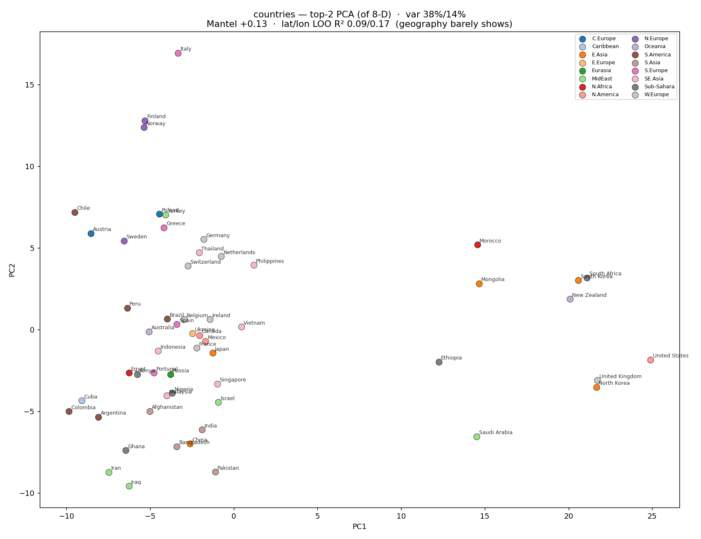
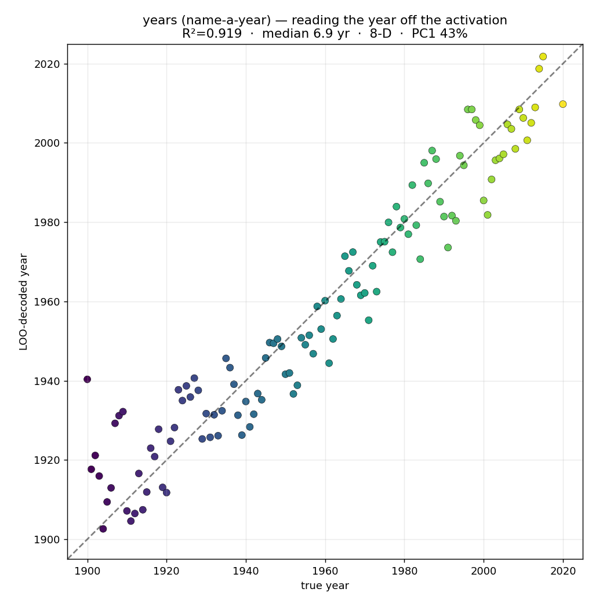
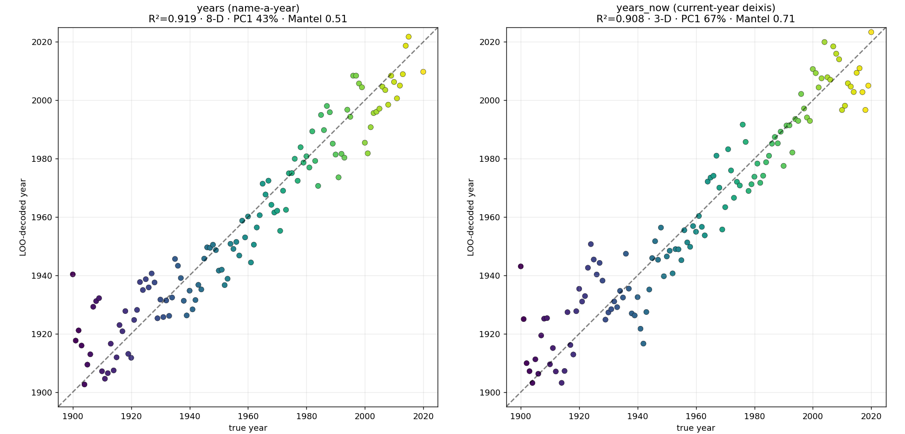
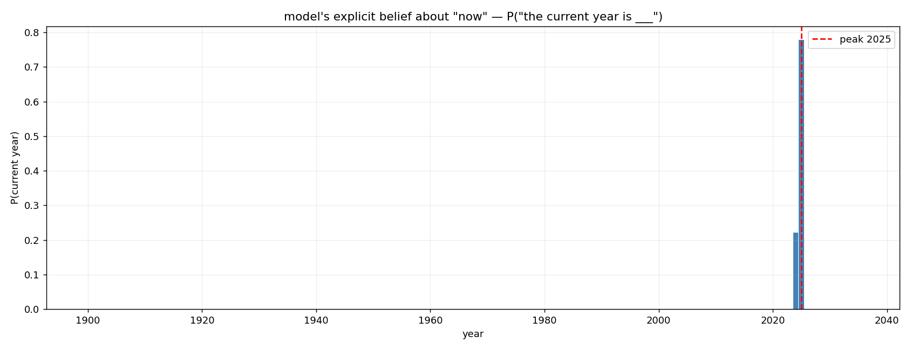
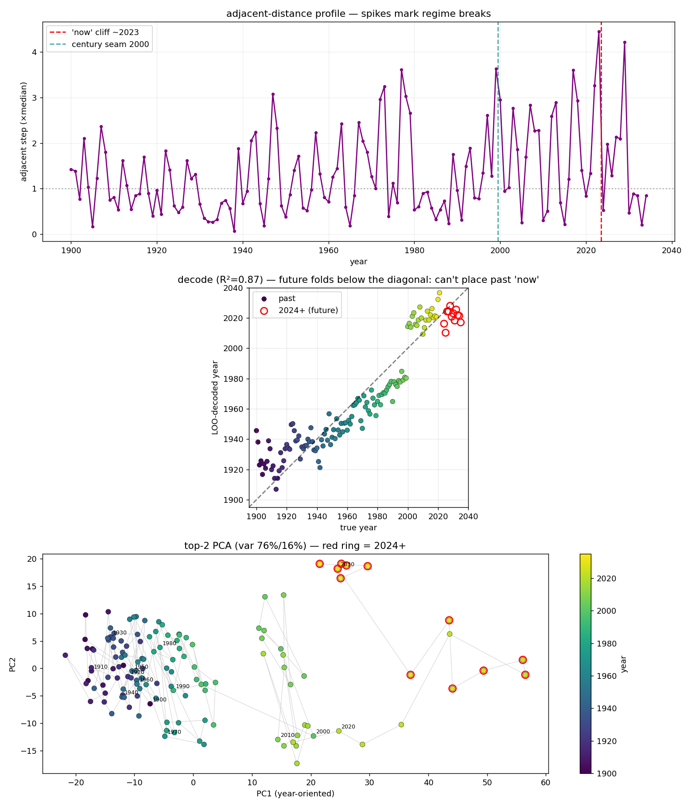

# Representation geometry: what shape does a vocabulary make?

These examples build templated discover manifolds over structured vocabularies —
countries, years — and read the geometry of the fitted layout. The question they
ask is simple: when a model represents a set of related tokens, does the layout of
those representations recover the structure the tokens actually have? Countries
have locations; years have an order. Does either fall out of the activations?

The short answer is that a model encodes the structure its *training text* imposes
on a token, and nothing else. Years come out ordered, because text talks about
years in order. Countries do not come out as a map, because text names countries;
it does not lay them on a grid. The most interesting result is what happens when
you change *how* you ask: framing a year as "the current year" reorganises the same
information into a much cleaner shape, and extending that framing past the present
turns the manifold into a detector for the model's own sense of "now."

Everything here is model-free to author — a template's node corpora are just its
`values × contexts`, generated deterministically — so the only GPU step is the fit.

## The machinery

A **template** is a slot, a set of candidate values, and a few neutral elicitation
contexts (`saklas/io/templates.py`). A **discover manifold** derived from it
(`manifold from-template`) lays the per-value centroids out in a per-model subspace
at fit time, choosing flat/curved/periodic geometry automatically. The same
template feeds two consumers: the manifold fit (a steering surface, and the layout
these scripts analyse) and the completion **scorer** (`session.score_template` — a
restricted-choice logit read). The "now" result below uses both, independently, and
they agree.

Four probes, in `data.py`:

| probe | what it is |
|---|---|
| `countries` | 56 country names, neutral "name a country" framing — the negative control |
| `years` | every year 1900–2020, neutral "name a year" framing |
| `years_now` | the same years framed as *the current year* |
| `years_now_future` | current-year framing extended to 2035 — runs past the present |

## Running it

```bash
python examples/representation_geometry/author.py years_now_future        # pure-IO, no GPU
saklas manifold fit years_now_future -m google/gemma-3-4b-it              # the only GPU step
python examples/representation_geometry/analyze.py years_now_future -m google/gemma-3-4b-it
python examples/representation_geometry/score.py   years_now_future -m google/gemma-3-4b-it
```

`author.py all` authors every probe; `compare.py years years_now` tables the
framing A/B. Scripts default to `google/gemma-3-4b-it`; the numbers and figures
below are from `google/gemma-4-12B-it`. Running on a different model shows *that*
model's geometry — a smaller or older model reports its own, earlier "now."

## Countries: entity names are lexical, not geographic



The dominant axis (38% of the variance) is not geography — it is whether the name
has a space in it. Every country at the far right of PC1 is a two-word name
(*United States*, *South Korea*, *New Zealand*…); the shared sub-tokens pull them
together. Geography barely registers underneath: the correlation between manifold
distance and great-circle distance is only +0.13, the leave-one-out decode of
latitude/longitude can't beat guessing the centroid, and within Europe — the
densest, most confound-free region, where you would most expect France–Germany–
Belgium adjacency — the correlation is **+0.006**, i.e. nothing.

The lesson generalises: a discover manifold over bare entity *names* reads lexical
identity, not the entities' world-knowledge relations. Geography is real knowledge
the model has, but it is not in the country-name centroid under neutral elicitation.

## Years: an ordinal vocabulary recovers its order



Years are the opposite case. The held-out year decodes off the activation to within
about seven years (LOO R² = 0.92), and manifold distance tracks elapsed time
(Mantel +0.51). The order is unmistakably present — because text imposes it.

But under neutral "name a year" framing it is *smeared*: it takes eight dimensions
to hold the timeline, and the top axis alone is only a 0.63 proxy for the year. The
model stores the order, but as a distributed code threaded through the digit-token
lexical scaffold, with seams where the digits roll over (1999→2000 is a ~2× jump).

## Framing controls the geometry



Re-asking the same question as *"the current year is …"* reorganises the geometry
without changing the information:

| metric | `years` (name-a-year) | `years_now` (current-year) |
|---|---|---|
| intrinsic dim | 8 | **3** |
| PC1 variance | 43% | **67%** |
| decode year LOO R² | 0.919 | 0.908 |
| \|Spearman(PC1, year)\| | 0.63 | **0.92** |
| Mantel (dist vs \|Δyr\|) | 0.51 | **0.71** |
| century seam | 1.9× | **4.0×** |

Decode accuracy is unchanged — the information is identical — but the smeared 8-D
lexical code collapses onto a clean ~1-D recency line. A frame that engages a real
judgment ("is this plausibly now?") gives a lower-dimensional, more steerable
surface than a neutral mention. The century seam *doubles*, too: anchoring to the
present makes "this century vs last" a sharp plausibility cliff.

## Reading the model's sense of "now"

That cliff is the payoff. Extend the current-year framing past the present
(`years_now_future`, through 2035) and ask where the recency line breaks — two
independent ways.



The **scorer** reads the model's explicit belief: the restricted-choice
distribution over *"the current year is ___"* is a single spike at **2024–2025**
(P = 0.78 / 0.22, everything else ≈ 0). That is the training-cutoff horizon, read
straight off the logits.



The **manifold geometry** lands in the same place, from an entirely different
computation:

- the largest adjacent step in the modern era is **2023→2024 at 4.4× the median** —
  a bigger seam than the turn of the century;
- the decode residual *flips sign* exactly at the present: 2015–2023 decode as
  more recent than they are (the model crowds the recent past toward now), and
  2024-onward fold *back below* the diagonal (it cannot place a year it never saw,
  so the future collapses toward the cutoff);
- the future years bunch tighter than the recent past — undifferentiated, because
  there is no training signal out there.

Two reads — the captured-activation layout and the next-token probability — computed
from different operations, converging on the same year. You can read a language
model's sense of the present out of its activation geometry, and it agrees with what
it will say to within a year.

## Files

- `data.py` — the four probe definitions (slot, values, contexts).
- `author.py` — author a probe's template + discover manifold (pure-IO).
- `analyze.py` — read a fitted layout: geographic (countries) or ordinal + cliff (years).
- `score.py` — the scorer read: the model's explicit P(current year).
- `compare.py` — the framing A/B over two ordinal probes.
- `plot_3d.py` — a rotating 3D PCA of a probe's centroids (GIF, regenerated on demand).
